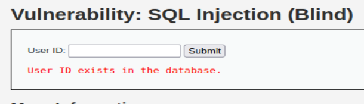
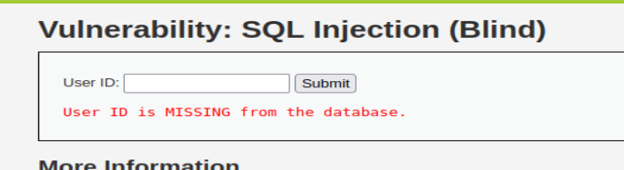
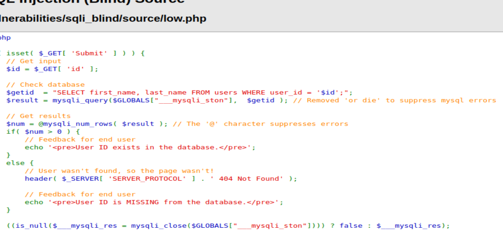
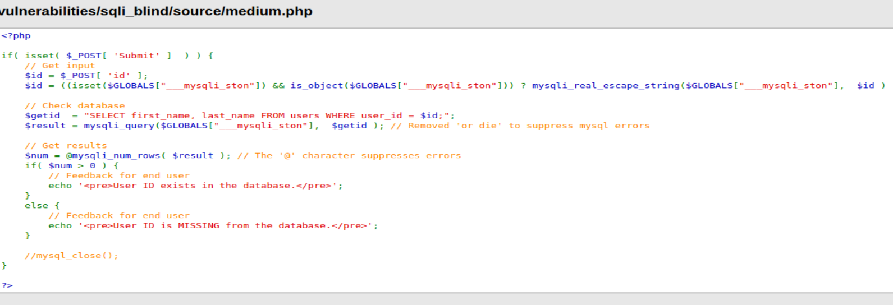
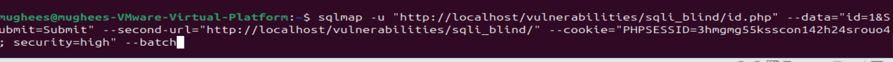
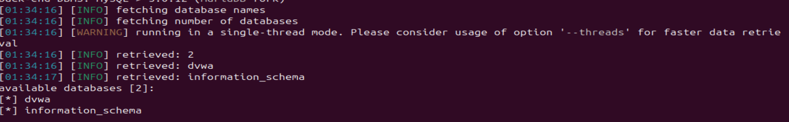
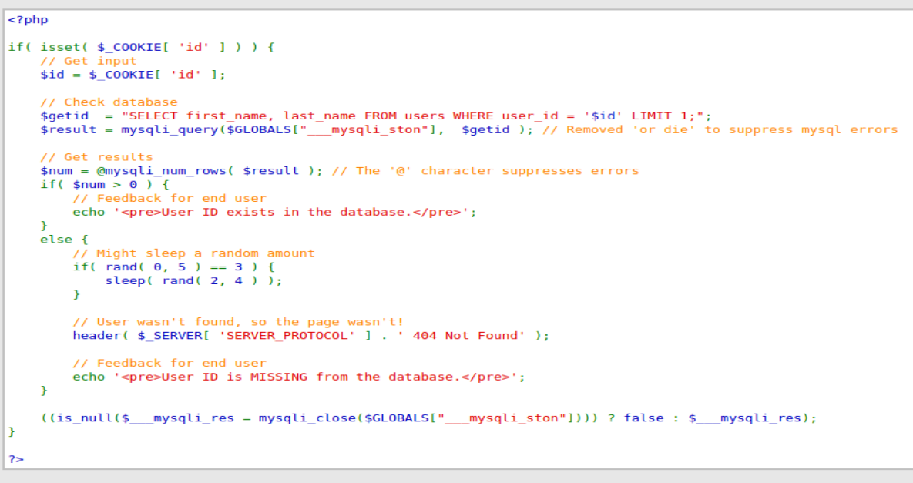
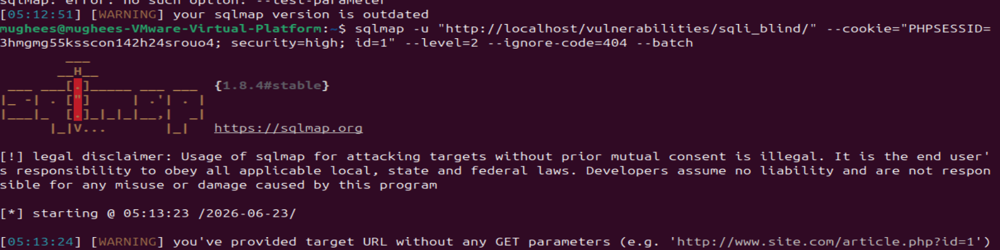
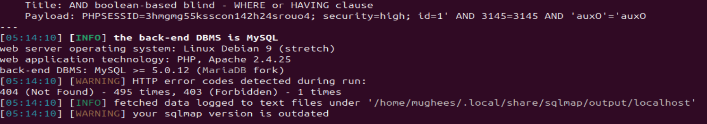

# DVWA SQL Injection (Blind) Writeup

**Difficulty Levels Covered:** Low | Medium | High  
**Vulnerability Class:** CWE-89 — Improper Neutralization of Special Elements used in an SQL Command  
**Tools Used:** SQLMap, Browser Developer Tools, Burp Suite

---

## What is Blind SQL Injection?

Blind SQL Injection is the same underlying vulnerability as regular SQL Injection — user input being concatenated directly into a SQL query without sanitization. The difference is what happens on the frontend: the application deliberately suppresses database output, so the attacker cannot see query results directly on the page.

This makes manual extraction extremely tedious. Instead of seeing the data returned, you are limited to observing **true/false behavior** — does the page respond differently when the condition is true versus false? Every piece of information has to be inferred one bit at a time from those binary responses.





The backend source code contains the exact same vulnerabilities as regular SQL Injection — no parameterized queries, no sanitization. Only the output is blocked, not the vulnerability itself.

---


## Tool — SQLMap

Because manual blind injection requires sending hundreds of requests to extract a single value character by character, the standard approach is to use **SQLMap** — an automated SQL injection tool that handles the entire process.

Install it if you don't have it:

```bash
sudo apt install sqlmap
```

SQLMap automates the true/false probing process, sending crafted payloads and inferring database contents from response differences — the same logic a manual attacker would use, but at machine speed.

---

## Low Security

### What the Code Does Wrong

The source code is identical in vulnerability to the Low level of regular SQL Injection — the id parameter is fetched from the request and concatenated directly into the query. The only difference is the application blocks output from being displayed to the user.



### Exploitation

Low security uses a **GET request** — the parameters are passed in the URL. The SQLMap command reflects this:

```bash
sqlmap -u "http://localhost/vulnerabilities/sqli_blind/?id=1&Submit=Submit" \
--cookie="PHPSESSID=your_session_id; security=low" \
--dbs
```

Breaking down the flags:

- `-u` — the target URL. The `id=1` is the injection point SQLMap will test, and `Submit=Submit` is what the request expects to be present
- `--cookie` — required because DVWA uses session authentication. The `PHPSESSID` value can be grabbed from your browser's Developer Tools under Application → Cookies, or by intercepting a request in Burp Suite. `security=low` tells DVWA which difficulty level to apply
- `--dbs` — instructs SQLMap to enumerate all database names

**Output:** SQLMap returns the list of databases present on the server, confirming the injection point is exploitable despite no visible output in the browser.

---

## Medium Security

### What Changed

Medium switches the input method to a dropdown and changes the request type from GET to **POST** — the parameters are now sent in the request body rather than the URL.



### Exploitation

The SQLMap command needs to reflect the POST request structure:

```bash
sqlmap -u "http://localhost/vulnerabilities/sqli_blind/" \
--data="id=1&Submit=Submit" \
--cookie="PHPSESSID=YOUR_COOKIE; security=medium" \
--batch
```


The key change here is the `--data` flag:

- `--data` — tells SQLMap to send a POST request with the specified body. Without this flag, SQLMap defaults to GET. The `id=1&Submit=Submit` mirrors what the browser normally sends
- `--batch` — runs SQLMap non-interactively, automatically accepting default choices instead of prompting for input at each decision point
- The URL no longer contains parameters — they move into the `--data` body



**Output:** Same database enumeration result as Low. The POST vs GET distinction is a transport-level change — the underlying injection vulnerability is identical.

### Why Medium Was Still Exploitable

Changing from GET to POST does not affect exploitability in any way. The parameters still reach the backend unsanitized regardless of which HTTP method carries them. This is another example of UI-level restriction providing zero backend protection.

---

## High Security

### What Changed

High security introduces a different input mechanism — the `id` value is passed directly inside the **cookie** rather than as a URL parameter or POST body. This is a less common attack surface that requires adjusting how SQLMap delivers its payloads.



### Exploitation

```bash
sqlmap -u "http://localhost/vulnerabilities/sqli_blind/" \
--cookie="PHPSESSID=YOUR_SESSION; security=high; id=1" \
--level=2 \
--ignore-code=404 \
--batch
```


Breaking down the new flags:

- `id=1` is now inside the `--cookie` string — this tells SQLMap the injection point is in the cookie itself, not a URL or POST parameter
- `--level=2` — controls how aggressively SQLMap tests parameters. Level 1 (default) tests only GET/POST parameters. Level 2 extends testing to cookies. This is required here since `id` is in the cookie. Levels go up to 5, which tests every possible parameter including HTTP headers
- `--ignore-code=404` — prevents SQLMap from stopping if the server returns 404 responses during probing, which DVWA does under certain conditions at this level



**Output:** SQLMap successfully identifies the cookie-based injection point and returns system information — confirming exploitation even when the id is delivered through an unconventional channel.

### Why High Was Still Exploitable

Moving the parameter into a cookie changes the delivery mechanism but not the vulnerability. The backend still takes the `id` value and concatenates it into a SQL query unsanitized — it does not matter how that value arrived. SQLMap's `--level` flag exists precisely because attackers test every input channel, not just the obvious ones.

---

## How to Actually Fix This

The fix is identical to regular SQL Injection — **parameterized queries**. Blind injection exists because the same root cause exists: unsanitized input in SQL queries. Blocking output does not remove the vulnerability, it only makes it harder to exploit manually.

```php
// Vulnerable — output blocked but query still injectable
$id = $_REQUEST['id'];
$query = "SELECT first_name, last_name FROM users WHERE user_id = '$id';";

// Secure — parameterized query, blind or not is irrelevant
$stmt = $pdo->prepare("SELECT first_name, last_name FROM users WHERE user_id = ?");
$stmt->execute([$id]);
```

Additional hardening:

- Apply **least privilege** to the database user — limit what tables and databases the application account can query
- Never expose raw error messages to users — even suppressed output leaks information through timing differences and response behavior
- Monitor for **unusual query volumes** — blind injection requires many requests; anomaly detection catches it at the network level

---

## Key Takeaway

Hiding output does not fix SQL Injection — it just raises the effort required to exploit it. The vulnerability lives in the backend query construction, not the frontend display. An attacker with SQLMap can extract an entire database from a blind injection point in minutes. The only fix that works is parameterized queries.

---

*Part of the [DVWA Writeup Series](../README.md)*  
*Previous: [SQL Injection](../sql-injection/writeup.md)*  

